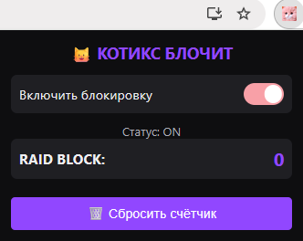
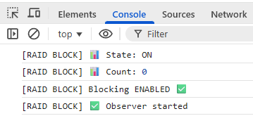
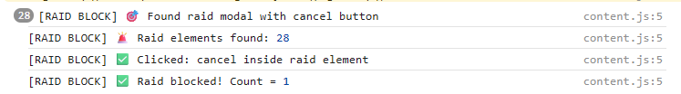

# 🐱 Котикс Блочит — Twitch Raid Blocker
**RU RU RU**

Chrome-расширение, которое автоматически отменяет рейды на Twitch, сохраняя ваш комфорт и контроль над просмотром.

## Типичный сценарий

> **Ситуация:** Вы уснули под любимым стримом.  
> **Что происходит:** Стример завершает эфир и запускает рейд на случайный канал.  
> **Без расширения:** Вы просыпаетесь от громкой музыки или чужой речи на незнакомом канале.  
> **С «Котикс Блочит»:** Расширение замечает окно рейда (на русском или английском) и мгновенно нажимает **«Отменить»**. Вы остаетесь на странице завершения стрима в тишине.

## Возможности

- 🤖 **Полная автоматизация:** Самостоятельно находит и закрывает окна рейдов.
- 🌍 **Двуязычная поддержка:** Понимает интерфейс Twitch на **русском** и **английском** языках.
- ⚙️ **Управление:** Включение/выключение защиты одним кликом через поп-ап.
- 📊 **Статистика:** Считает количество спасенных вас от рейдов (сохраняется даже после перезагрузки браузера).
- 🔒 **Безопасность:** Использует Manifest V3, минимальные разрешения (только `storage`), не собирает личные данные.

## Как это выглядит

| Настройки расширения | Работа в действии |
|:---:|:---:|
|  |   |
| *Главное меню со статистикой* | *Автоматическая отмена рейда* |

## Установка (из исходников)

1. Скачайте или клонируйте этот репозиторий.
2. Откройте браузер Google Chrome и перейдите по адресу `chrome://extensions/`.
3. Включите **«Режим разработчика»** (Developer mode) в правом верхнем углу.
4. Нажмите кнопку **«Загрузить распакованное расширение»** (Load unpacked).
5. Выберите папку с файлами расширения (`manifest.json` должен быть внутри).
6. Готово! Значок появится в панели расширений.

## Структура проекта

- `manifest.json` — конфигурация расширения (Manifest V3).
- `background.js` — инициализация хранилища и настроек.
- `content.js` — ядро логики: поиск кнопок рейда, обработка языков, авто-клик.
- `popup.html` / `popup.js` — визуальный интерфейс управления и статистики.

## Требования

- **Браузер:** Google Chrome версии 147 +

## 📄 Лицензия

MIT
___________________

**EN EN EN**

Chrome extension that automatically cancels raids on Twitch, preserving your comfort and control over viewing.

## Typical Scenario

> **Situation:** You fell asleep under your favorite stream.  
> **What happens:** The streamer ends the broadcast and launches a raid on a random channel.  
> **Without the extension:** You wake up to loud music or someone else's speech on an unfamiliar channel.  
> **With «Котикс Блочит»:** The extension detects the raid window (in Russian or English) and instantly clicks **«Cancel»**. You stay on the stream end page in silence.

## Features

- 🤖 **Full Automation:** Independently finds and closes raid windows.
- 🌍 **Bilingual Support:** Understands Twitch interface in **Russian** and **English**.
- ⚙️ **Control:** Enable/disable protection with one click via popup.
- 📊 **Statistics:** Counts the number of raids saved from you (persisted even after browser restart).
- 🔒 **Security:** Uses Manifest V3, minimal permissions (only `storage`), does not collect personal data.

## How It Looks

| Extension Settings | Action in Progress |
|:---:|:---:|
|  |   |
| *Main menu with statistics* | *Automatic raid cancellation* |

## Installation (from source)

1. Download or clone this repository.
2. Open Google Chrome browser and go to `chrome://extensions/`.
3. Enable **«Developer mode»** in the top right corner.
4. Click **«Load unpacked»**.
5. Select the folder with the extension files (`manifest.json` must be inside).
6. Done! The icon will appear in the extensions panel.

## Project Structure

- `manifest.json` — extension configuration (Manifest V3).
- `background.js` — storage and settings initialization.
- `content.js` — core logic: raid button detection, language handling, auto-click.
- `popup.html` / `popup.js` — visual control interface and statistics.

## Requirements

- **Browser:** Google Chrome version 147+

## 📄 License

MIT

